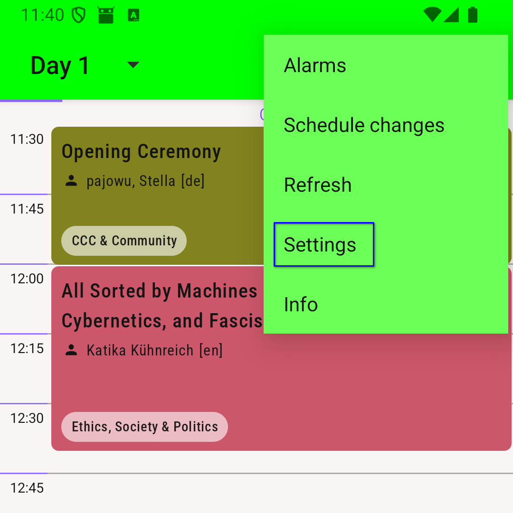
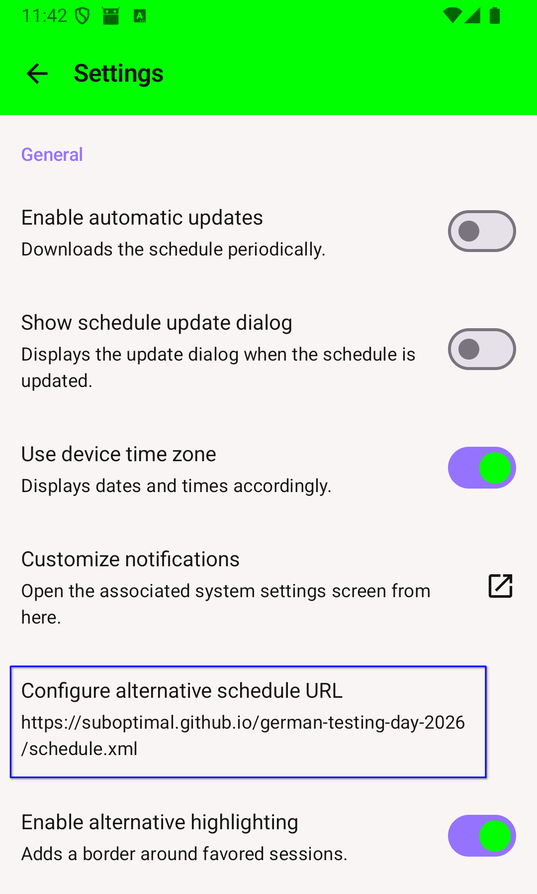
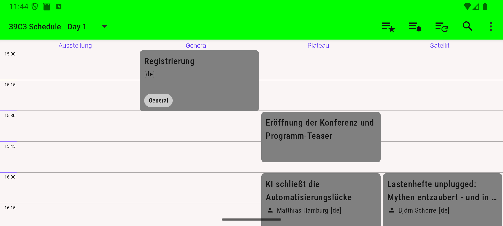
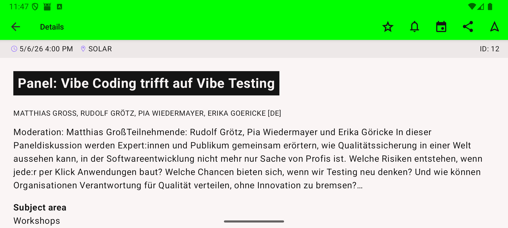
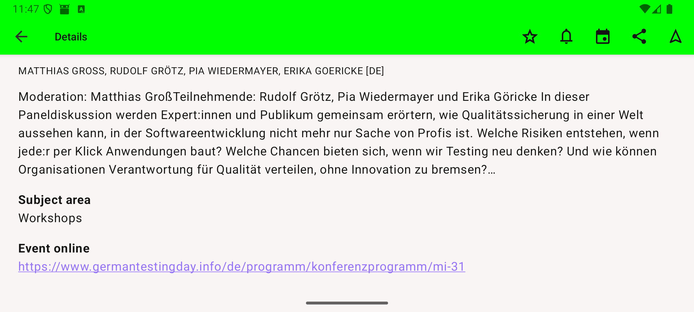
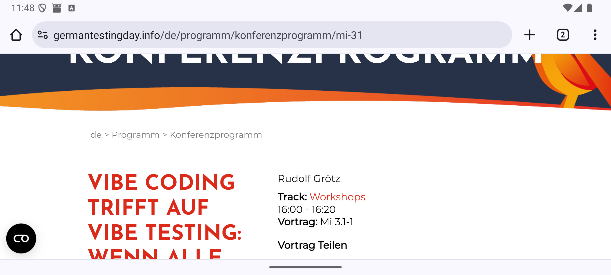
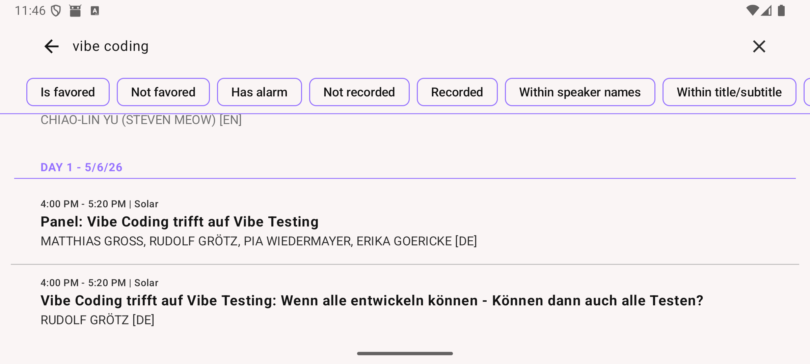

:toc:
:!toc-title:
:toclevels: 1
:sectnums: 1

ifdef::env-github[]
:tip-caption: :bulb:
:note-caption: :information_source:
:important-caption: :heavy_exclamation_mark:
:caution-caption: :fire:
:warning-caption: :warning:
endif::[]

== General

For convenient schedule access on Android, the conference schedule is provided in a format compatible with the https://eventfahrplan.eu[EventFahrplan] app.

With the app, you can view the schedule in a table layout, search for talks, add talks to favorites, and more.

Following the KISS principle, this setup reuses the app published for the https://events.ccc.de/category/39c3/[39. Chaos Communication Congress Schedule]. You can install it from https://f-droid.org/de/packages/info.metadude.android.congress.schedule/[F-Droid] or the https://play.google.com/store/apps/details?id=info.metadude.android.congress.schedule[Google Play Store].

Because the app was originally built for another conference, you may still see some CCC-related labels now and then. 😉

For app licenses, see https://github.com/EventFahrplan/EventFahrplan#licenses

== Quick Start

. Install the app from F-Droid or Google Play.
. Open the app menu (triple-dot icon) and select "Settings".
. Disable "Enable automatic updates".
. Disable "Show schedule update dialog".
. Open "Configure alternate schedule URL" and enter:
+
[source,properties]
----
https://suboptimal.github.io/german-testing-day-2026/schedule.xml
----
. Go back to the schedule and select "Day 1" or "Day 2".

== Configuration

=== Open settings

Open app settings from the triple-dot menu in the top-right corner and select "Settings".

=== Insert alternate schedule URL

Disable "Enable automatic updates" and "Show schedule update dialog".

Then open "Configure alternate schedule URL" and paste:

[source,properties]
----
https://suboptimal.github.io/german-testing-day-2026/schedule.xml
----

== Usage

=== Schedule view

The schedule is easiest to read in landscape mode.
The first row shows the locations as column headers.

Use the day selector at the top to switch between "Day 1" and "Day 2" (chose the top two entries).

NOTE: If multiple talks share the same time slot and location, only the first one is shown in the schedule view. Use search to find the others by title, description, or speaker.

Tap an event to open details, including description and speakers.

Tap the URL shown at "Event online" to open the talk details on the conference website.

=== Search

Use the search (magnifier icon) to find talks by title, description, or speaker name.

